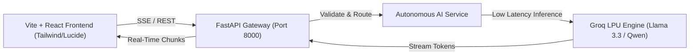

# 16Bits ⚡

### Autonomous Intelligence & Next-Gen Solution

  
    Production Hackathon Demo
  

  Team 16Bits • September 2026

<!--
Presenter Note:
Hook the judges within the first 15 seconds. State the problem boldly before revealing the demo.
-->

---
layout: two-cols
---

# The Problem 🚨

### Why Existing Solutions Break

<v-clicks>

- **Latency & Inefficiency**: Current systems require multi-step manual intervention.
- **Context Fragmentation**: Siloed tools prevent unified decision making.
- **High Friction**: End-users spend hours doing repetitive cognitive work instead of high-leverage execution.

</v-clicks>

::right::

  <h3 class="text-red-400 font-bold mb-2">Market Reality</h3>
  

    Over 70% of domain workflows suffer from data lag and manual synchronization overhead, draining productive output and introducing human error.
  

<!--
Presenter Note:
Emphasize the pain point. Show that the judges or consumers feel this pain daily.
-->

---
layout: default
---

# The Solution: 16Bits 💡

A high-performance autonomous agentic system providing sub-second intelligence and automated execution.

  

    
⚡

    
Ultra-Low Latency

    
Sub-second inference via Groq LPUs and optimized streaming pipelines.

  

  

    
🧠

    
Autonomous Logic

    
Agentic state evaluation and self-correcting validation layers.

  

  

    
🖥️

    
Modern Visual UI

    
Vite-powered reactive interface with real-time feedback.

  

---
layout: default
---

# System Architecture 🛠️

---
layout: two-cols
---

# Market & Business Viability 📈

<v-clicks>

- **Target Audience**: High-velocity teams, developers, and enterprises.
- **Go-To-Market**: Open-source community adoption + Enterprise tier.
- **Defensibility**: Low switching costs, extreme speed advantage, and unified state orchestration.

</v-clicks>

::right::

  <h3 class="text-emerald-400 font-bold mb-2">Competitive Edge</h3>
  <ul class="text-gray-300 text-sm space-y-2">
    <li>• 10x faster execution than legacy workflows</li>
    <li>• Zero vendor lock-in with open-standard architectures</li>
    <li>• Built for scale from Day 1</li>
  </ul>

---
layout: center
class: text-center
---

# Live Demonstration 🎬

Let's see **16Bits** in action!

  <a href="http://localhost:5173" target="_blank" class="px-6 py-3 bg-emerald-600 hover:bg-emerald-500 text-white rounded-lg font-semibold transition shadow-lg shadow-emerald-500/20">
    Launch Application →
  </a>

  Team 16Bits • Q&A Session

