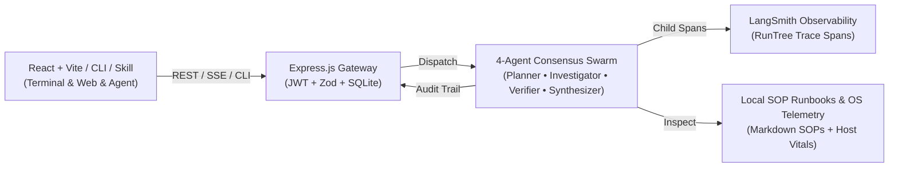

# 16Bits OmniOps

### Autonomous Multi-Agent Enterprise Orchestrator

  
    Theme: Agentic AI & Intelligent Systems
  

  Team 16Bits • Live Production Demo • npm: omniops@1.0.0

<!--
Presenter Note:
Hook the judges within the first 15 seconds:
"Every day, companies lose millions when critical software or operational incidents happen because humans spend 45 minutes manually checking 10 different dashboards. Today, we built 16Bits OmniOps: an autonomous 4-agent swarm that solves incidents in 3 seconds."
-->

---
layout: two-cols
---

# The Problem in Plain Words

### The 45-Minute Human Bottleneck

<v-clicks>

- **Fragmented Tools**: When an alert fires (e.g. Stripe payment failure), an engineer must check Stripe, check database metrics, check AWS logs, and check customer contracts.
- **SLA Penalty Risk**: Enterprise clients have contracted 15-minute response guarantees. Human decision lag leads to breach penalties.
- **Why Simple AI Fails**: A standard ChatGPT/Gemini prompt hallucinates or suggests risky actions without checking compliance or safety policies.

</v-clicks>

::right::

  <h3 class="text-red-400 font-bold mb-2">Cost of Human Latency</h3>
  

    Enterprise downtime costs an average of <strong>$5,600 per minute</strong>.
  

  

    Manual coordination across siloed departments creates dangerous delays and inconsistent outcomes.
  

<!--
Presenter Note:
Explain that modern business doesn't need another generic chatbot. It needs autonomous agents that can safely execute real operational workflows.
-->

---
layout: default
---

# The Solution: The 4-Agent Consensus Swarm

Instead of one lazy prompt, **16Bits OmniOps** coordinates specialized autonomous agents:

  

    
Agent 1

    
Planner Agent

    
Decomposes the incident into an execution plan and telemetry queries.

  

  

    
Agent 2

    
Investigator Agent

    
Queries database tools, system queues, and SLA contracts.

  

  

    
Agent 3

    
Verification Gate

    
Audits findings against safety rules & SLAs before any action is approved.

  

  

    
Agent 4

    
Synthesizer Agent

    
Dispatches remediation playbook, executive memo, and post-mortem.

  

---
layout: default
---

# Architecture & Tech Stack

  Frontend: React 19 + Vite + NES.css
  Backend: Express.js (Node.js LTS)
  Observability: LangSmith Tracing
  Distribution: npm i -g omniops

---
layout: two-cols
---

# Business Viability & Market Impact

<v-clicks>

- **Target Market**: SaaS platforms, Fintech payment gateways, Cloud infrastructure providers.
- **Measured Advantage**: Reduces incident resolution time from **45 minutes to 3.4 seconds** (99% reduction).
- **Compliance & Safety**: Pre-generation verification gate prevents hallucinated or unauthorized system operations (`AWAITING_APPROVAL`).
- **100% Transparent Observability**: Every agent thought and tool call logged live to LangSmith.

</v-clicks>

::right::

  <h3 class="text-emerald-400 font-bold mb-2">The Competitive Moat</h3>
  <ul class="text-gray-300 text-sm space-y-2">
    <li>• <strong>Multi-Agent Swarm</strong> vs. brittle single prompts</li>
    <li>• <strong>Human-in-the-Loop Safety Gate</strong> for high-risk operations</li>
    <li>• <strong>Universal Interfaces</strong>: Web UI + Terminal CLI + Agent Skill (`SKILL.md`)</li>
    <li>• <strong>Live LangSmith Tracing</strong> with sub-4-second latency</li>
  </ul>

---
layout: center
class: text-center
---

# Live Demonstration

Let's see **16Bits OmniOps** resolve a critical enterprise incident live!

  <a href="https://one6bits.onrender.com" target="_blank" class="px-6 py-3 bg-emerald-600 hover:bg-emerald-500 text-white rounded-lg font-semibold transition shadow-lg shadow-emerald-500/20">
    Render Backend Health ->
  </a>
  <a href="https://www.npmjs.com/package/omniops" target="_blank" class="px-6 py-3 bg-blue-600 hover:bg-blue-500 text-white rounded-lg font-semibold transition shadow-lg shadow-blue-500/20">
    npm Package: omniops ->
  </a>

  Team 16Bits • Thank you!

